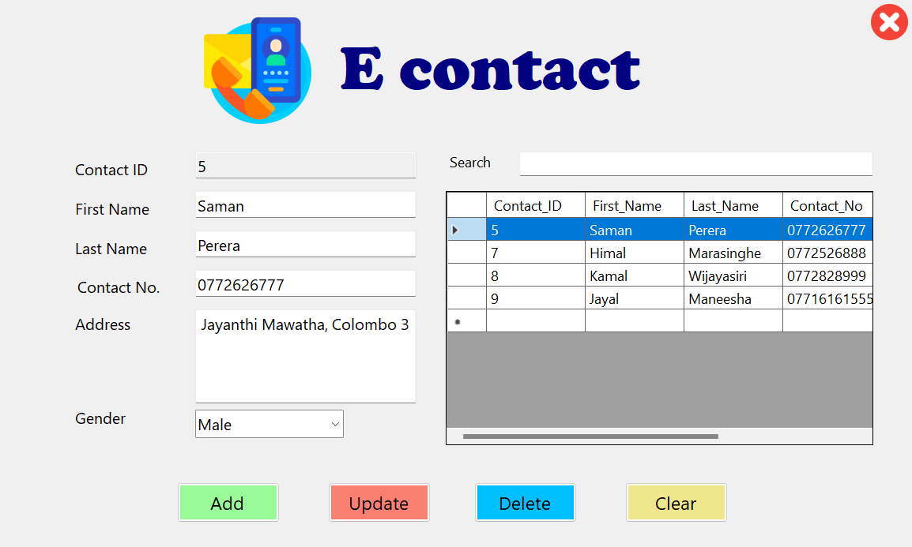

<!DOCTYPE html>
<html lang="en">
<head>
    <meta charset="UTF-8">
    <meta name="viewport" content="width=device-width, initial-scale=1.0">
</head>
<body>
    

        <h1>Econtact Desktop Application</h1>
        

            Econtact is a desktop application built using Visual Studio, Microsoft .NET, and MySQL.
            It allows users to store, update, delete, and clear contact information in a database.
            The application includes a search bar and a display window to show and search data.
        
        
        <h2>Features</h2>
        <ul>
            <li>Store contact details including names, contact numbers, addresses, and gender.</li>
            <li>Update existing contact information.</li>
            <li>Delete contact records from the database.</li>
            <li>Clear all data from the input fields.</li>
            <li>Search bar to find any word within the contact details.</li>
            <li>Display window to show all stored contact information.</li>
        </ul>
        <h2>Technologies Used</h2>
        <ul>
            <li><strong>Visual Studio:</strong> Integrated development environment used for the application development.</li>
            <li><strong>Microsoft .NET:</strong> Framework used for building the application.</li>
            <li><strong>MySQL:</strong> Database used for storing contact information.</li>
        </ul>
        <h2>Installation</h2>
        <h3>Prerequisites</h3>
        <ul>
            <li>Visual Studio (2019 or later recommended)</li>
            <li>.NET Framework (4.7.2 or later)</li>
            <li>MySQL Server and MySQL Workbench</li>
        </ul>
        <h2>Usage</h2>
        <ol>
            <li><strong>Adding a Contact:</strong>
                <ul>
                    <li>Fill in the name, contact number, address, and gender fields.</li>
                    <li>Click the "Add" button to store the contact information in the database.</li>
                </ul>
            </li>
            <li><strong>Updating a Contact:</strong>
                <ul>
                    <li>Select a contact from the display window.</li>
                    <li>Modify the desired fields.</li>
                    <li>Click the "Update" button to save the changes.</li>
                </ul>
            </li>
            <li><strong>Deleting a Contact:</strong>
                <ul>
                    <li>Select a contact from the display window.</li>
                    <li>Click the "Delete" button to remove the contact from the database.</li>
                </ul>
            </li>
            <li><strong>Clearing the Fields:</strong>
                <ul>
                    <li>Click the "Clear" button to clear all input fields.</li>
                </ul>
            </li>
            <li><strong>Searching for a Contact:</strong>
                <ul>
                    <li>Enter a keyword in the search bar.</li>
                    <li>The display window will show contacts matching the keyword.</li>
                </ul>
            </li>
        </ol>
        <h2>Screenshots</h2>
        

        
<em>Main interface of the Econtact desktop application.</em>

        
For any questions or suggestions, feel free to reach out to the project maintainer:

        <ul>
            <li><strong>Name:</strong> Rashmi Pubuditha</li>
        </ul>    
        

        
Enjoy using the Econtact Desktop Application!

    

</body>
</html>
